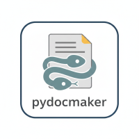

# pydocmaker

<p align="center">
  
  
  <!--  -->
  
  
  
  

</p>

<div align="center">

  

</div>

A minimal easy to use python document maker to create reports in `pdf`, `md`, `typst`, `html`, `docx`, `tex` and more formats. Written purely in python, but optional features use external non python libraries such as `typst` or pandoc (if installed). Nearly no code written by AI (some test cases, and some documentation was written by AI tools)


- **NOTE:** some functions will try to call pandoc and fall back if not found.
- **NOTE:** exporting PDFs by default works using `typst`. All other engines need optional dependencies, such as either a latex compiler or Microsoft Word, or Libreoffice.

Full documentation at https://pydocmaker.readthedocs.io/en/latest/

For an **example of a created PDF document** please see `README.pdf` (located within the root folder of this repository) which is this `README.md` file converted to pdf via `pydocmaker` and `typst` with the `report` template.  

## Installation

Install via:

```bash
pip install pydocmaker
```


## TL;DR; Code examples

### Snippet:

```python

import pydocmaker as pyd

doc = pyd.Doc.get_example()
doc.show()
```

### Minimal Usage Example:

```python

import pydocmaker as pyd

doc = pyd.Doc() # basic doc. Workd like a list, We always append new content to the end
doc.add('dummy text') # adds raw text

# this is how to add parts to the document
doc.add_pre('this will be shown as preformatted') # preformatted
doc.add_md('This is some *fancy* `markdown` **text**') # markdown
doc.add_tex(r'\textbf{Hello, LaTeX!}') # latex
doc.add_table([['John Doe', "30"]], header=['Name', 'Age'], caption='example table') # table

# this is how to add an image from link
doc.add_image("https://github.githubassets.com/assets/GitHub-Mark-ea2971cee799.png", caption='Github Logo')

# this is how to add matplotlib figures to your report
import matplotlib.pyplot as plt
fig = plt.figure()
plt.plot([1,2,3], [6,5,7])
doc.add_image(fig, caption='Example figure', width=0.7)

# show will render and show a doc when in an iPython
# environment such as jupyter or colab, on the terminal 
# it will fall back to use rich console instead
doc.show()
```

### "Showing" Documents in iPython/Terminal

the `Doc` class has a method called `show` which will detect if its running in `Ipython`. If it does it will render the document and show it. 
If not it will fallback to a rich consiole and do its best to show the content on the terminal (on a terminal image support is very limited).
The desired rendering format can be set with the `engine` argument. `rich`, `markdown`, `HTML`, or `PDF` is possible. 

Any environment:
**NOTE**: when rendering with "rich" console image support is very limited, since images will be printed on the console as pixels (with the size being scaled down to the console width)

```python
doc.show()
doc.show('rich')
doc.show('rich', embed_images=False)
```

In `Ipython` (such as Jupyter or Colab) any of the following:

```python
doc.show('md')
```

Or: 
```python
doc.show('html')
```

Or:
```python
doc.show('pdf')
```
**NOTE**: some IDEs do not support the PDF option and instead open a "save" dialog, but in a browser with jupyter this works

### Exporting:

export via:

```python
# returns string
text_html = doc.export('html')
# or write a file
doc.export('path/to/my_file.html')
```

Or alternatively:

```python
doc.to_html('path/to/my_file.html') # will write a HTML file
doc.to_pdf('path/to/my_file.pdf') # will write a PDF file via typst
doc.to_pdf('path/to/my_file.zip') # will write the whole latex project dir as a pdf file
doc.to_markdown('path/to/my_file.md') # will write a Markdown file
doc.to_docx('path/to/my_file.docx') # will write a docx file
doc.to_textile('path/to/my_file.textile.zip') # will pack all textile files and write them to a zip archive
doc.to_tex('path/to/my_file.tex.zip') # will pack all tex files and write them to a zip archive
doc.to_ipynb('path/to/my_file.ipynb') # will write a ipynb file

doc.to_json('path/to/doc.json') # saves the document
```

### Saving and Loading (Minimal)

A minimal example showing how to save and load `Doc` objects. `Doc.save` accepts a file path (string or `pathlib.Path`) or a file-like object. When no path is provided it returns the rendered content (HTML by default). `Doc.load` accepts a JSON string/bytes, a path, or a stream.

```python
import pydocmaker as pyd

doc = pyd.get_example()

# save to common formats (case-insensitive suffixes are supported)
doc.save('report.html')      # writes HTML
doc.save('report.json')      # writes JSON
doc.save('report.ipynb')     # writes an ipynb (may depend on environment)

doc2 = pyd.load('report.json') # load back in (should now be same as doc)

json_str = doc.save(format='json') # save as in-memory string in given format
loaded = pyd.load(json_str) # and load back


```

Supported save/load formats for `Doc.save`/`Doc.load`:

- `.html`, `.pyd`, `.pydoc`  — HTML serialization/serialization used by pydocmaker
- `.ipynb`                    — Jupyter notebook (may require additional environment support)
- `.json`                     — Raw document JSON (recommended for round-trip fidelity)

**Note**: Saving and Loading is fundamentally different from exporting a report (e.G. to_html), since save/load allows round trip loading and saving, while exporting makes nice documents to view in other other software and not load again.  


### Configuring Options:

All configurable options for this package are in `pydocmaker.options`. They are always callable 
functions with "*_get", "*_set", "*_scan" etc. 

```python

import pydocmaker as pyd

pyd.options.pandoc_allowed_set(False)
print(pyd.options.pandoc_allowed_get())

pyd.options.pdf_engine_set('typst') # default
print(pyd.options.pdf_engine_get())

```


### Install Optional Requirements


#### Optional Requirement `pandoc`

In order to get all functionality `pandoc` needs to be available. Please follow the recommended installation steps on the software projects webpage. For convenience the minimal installation is listed here:

On Linux (Debian/Ubuntu) install via: 

```bash
sudo apt update
sudo apt install pandoc
```

On MacOS: 

```bash
brew install pandoc
```

On Windows: 

```bash
winget install JohnMacFarlane.Pandoc
```


### Optional Requirement `Latex`

In order to get all functionality a latex compiler needs to be available. Please follow the recommended installation steps on the webpage. For convenience the minimal installation is listed here:

On Linux (Debian/Ubuntu) install via: 

```bash
sudo apt update
sudo apt install texlive-full
```

On MacOS:

```bash
brew install --cask mactex
```

On Windows:

```bash
winget install MiKTeX.MiKTeX
```

### Optional Requirement for DOCX either `libreoffice` or `win32com`


Some DOCX functionality need either Microsoft Windows and Microsoft Word and the `win32com` library or `libreoffice` available. 


#### Installing `pywin32` (Windows only)

Install via: 
```bash
pip install pywin32
```

#### Installing `libreoffice`

On a Linux (Debian/Ubuntu) system insall via:

```bash
sudo apt update
sudo apt-get install libreoffice
```

On MacOS: 

```bash
brew install --cask libreoffice
```

On Windows:

```bash
winget install TheDocumentFoundation.LibreOffice
```

**NOTE**: You need to add the folder with the libreoffice executeables to PATH in windows. 

### Writing Word docx Documents with templates and fields

Below is an example on how to use pydocmaker to write word docx documents from format templates
and also automatically "replace" fields (MergeFields in Word or plain text) to be filled out in 
the docx document with text from python.

(**NOTE**: some of the code below utilized the ``win32com`` api and only works on windows)

prepare a report, a template and some fields in the template:

```python

import pydocmaker as pyd

metadata = {
    'repno': "1234",
    "summary": "This is a nice workflow for automatically creating docx documents",
    "date": "2025-12-13",
    "comment": f"this works!",
    "author": "Me"
}

# HOWTO: 
#  Adding MergeFields In Word to replace them later: 
#    Go to Insert → Quick Parts → Field → MergeField.
templatepath = 'my/path/template.docx'
outpath = 'my/path/outfile.docx'

# get a pyd example document to show the concept
doc = pyd.get_example()

```

this is the quick and easy way using the common pydocmaker api:

```python
# three different examples below
docx_bts = doc.to_docx("my/path/outfile.docx", template=templatepath, template_params=metadata, use_w32=False)
docx_bts = doc.to_docx("my/path/outfile_w32.docx", template=templatepath, template_params=metadata, use_w32=True)
docx_bts = doc.to_docx("my/path/outfile_w32_comp.pdf", template=templatepath, template_params=metadata, use_w32=True, as_pdf=True, compress_images=True)
```

